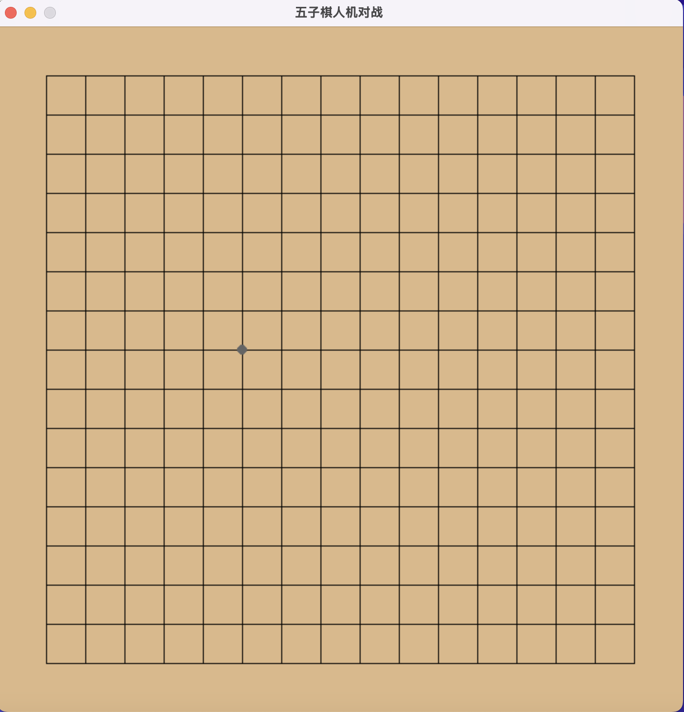

# pythonmctsgobang

 <!-- 可替换为实际截图链接 -->

## 项目概述

本项目是一个五子棋人机对战游戏，AI决策基于**蒙特卡洛树搜索（MCTS）**算法实现，使用Pygame构建图形界面。AI通过模拟大量随机对局评估每一步的潜在价值，逐步优化决策树，最终选择胜率最高的落子位置。

## 文件结构

```plaintext
.
├── globals.py       # 全局配置（棋盘参数、颜色、UCB权重等）
├── mcts.py          # MCTS算法核心实现（节点与搜索逻辑）
├── mygame.py        # Pygame主循环与游戏逻辑
├── point.py         # 棋子类（坐标与颜色）
└── publictool.py    # 工具函数（胜利检测、位置校验）
```

## MCTS 原理

蒙特卡洛树搜索（MCTS）通过模拟对局构建搜索树，包含四个阶段：

1. **选择（Selection）**  
   从根节点出发，根据UCB公式选择最有潜力的子节点，直到到达叶子节点。  
   **UCB公式**：  
   $$
   \text{UCB} = \text{胜率} + c \times \sqrt{\frac{\ln(\text{父节点访问次数})}{\text{子节点访问次数}}}
   $$
   其中 \(c\) 由 `globals.py` 中的 `UCB_WEIGHTS` 控制。

2. **扩展（Expansion）**  
   若当前节点未完全扩展，生成所有合法移动的子节点。

3. **模拟（Simulation）**  
   从扩展的节点出发，随机落子直到终局，判断胜负。

4. **回溯（Backpropagation）**  
   将模拟结果（胜负）沿路径回溯，更新所有祖先节点的访问次数和胜率统计。

---

## 核心代码解析：`mcts.py`

### 1. `Node` 类

- **功能**：表示搜索树中的一个节点，存储游戏状态和统计信息。
- **关键属性**：
  - `state`: 当前棋盘状态（棋子位置列表）。
  - `nowColor`: 当前落子方（1: 黑棋，-1: 白棋）。
  - `visits`: 节点访问次数。
  - `wins`: 黑棋胜利次数（用于胜率计算）。
- **核心方法**：
  - `expandNodes()`: 生成所有可能的子节点。
  - `calculateUCB()`: 计算UCB值，平衡探索与利用。
  - `getBestChild()`: 选择胜率最高的子节点。

### 2. `MCTS` 类

- **功能**：管理MCTS迭代过程。
- **核心方法**：
  - `iteration()`: 主循环，控制迭代次数（`MAX_ITER_NUM`）与时间限制（`MAX_ITER_TIME`）。
  - `__selection()`: 选择阶段，递归选择UCB值最高的子节点。
  - `__rollout()`: 模拟阶段，随机落子直到终局。
  - `__backPropagation()`: 回溯阶段，更新路径上的节点统计。

### 依赖安装

```bash
pip install pygame
```

### 启动游戏

```bash
python mygame.py
```

### 操作指南

- **人类玩家**：点击棋盘格落黑棋。
- **AI玩家**：自动计算后落白棋。
- 游戏结束后，点击“确定”按钮重新开始。

---

## 贡献与许可

欢迎提交Issue或Pull Request！  
本项目采用 [MIT License](LICENSE) <!-- 添加实际许可证文件 -->

## Install it from PyPI

```bash
pip install pythonmctsgobang
```

## Usage

```py
from pythonmctsgobang import BaseClass
from pythonmctsgobang import base_function

BaseClass().base_method()
base_function()
```

```bash
$ python -m pythonmctsgobang
#or
$ pythonmctsgobang
```

## Development

Read the [CONTRIBUTING.md](CONTRIBUTING.md) file.
